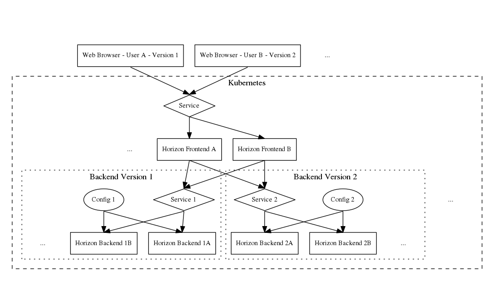

.. multi-node:

=================================
Kolla Kubernetes Horizon Upgrades
=================================

Horizon is a web based application that exists spread across both the server
infrastructure and the end users web browser. Unlike any other OpenStack
service in Kolla-Kubernetes, the browser does not keep a tcp connection alive
for the life of the applications access, so it is impossible to use regular
Kubernetes based session tracking/orchestration to perform safe rolling
upgrades.

To provide safe, transparent to end user rolling upgrades, Kolla-Kubernetes has
 implemented a frontend/backend system to support multiple simultaneous
instantiations of Horizon to be running in parallel, and a way for browsers to
be routed to the same version of Horizon they initially were loaded under.

Components
==========

Upgrade Procedure
=================

To safely perform an upgrade, there are two phases to the procedure.

Phase 1 - Add a new Backend:

1. Launch a new instance of the horizon backend with an unused version
   number = N.
2. Update the configmap for the frontend to include the new version N, and set
   the default as appropriate.
3. Update the frontend to apply the configmap change.

Wait until all existing Horizon authentication sessions are no longer valid,
to proceed to phase 2.

Phase 2 - Remove old Backend:
1. Update the configmap for the frontend to remove the old version of the
   backend, N-1.
2. Update the frontend to apply the configmap change.
3. Remove old Horizon backend.

